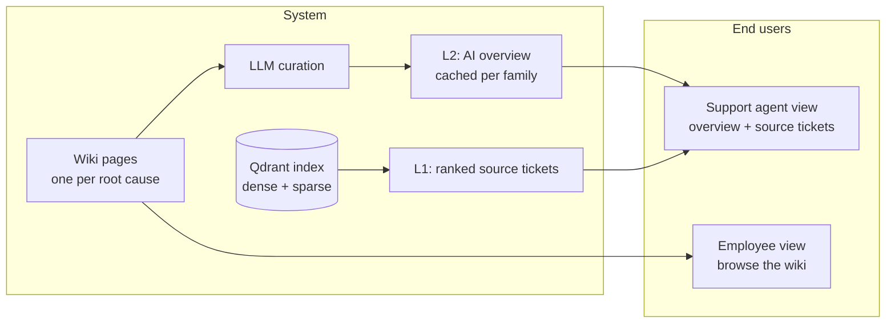
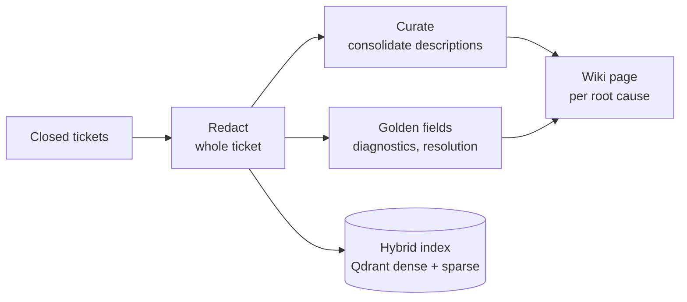
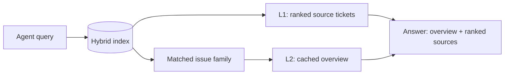
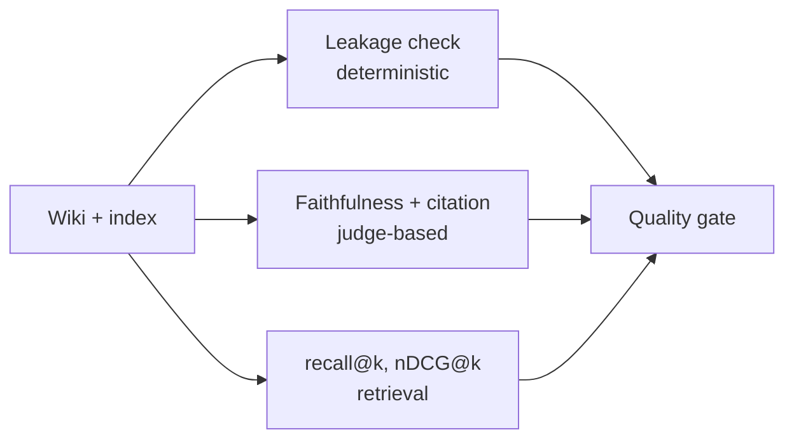
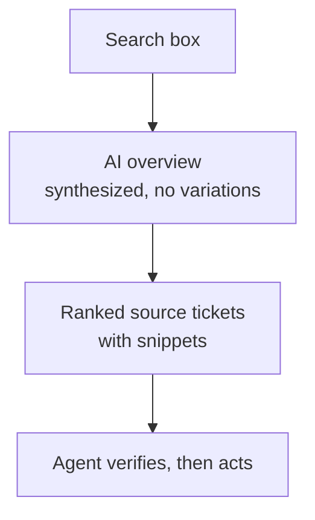

# Architecture

This system adapts the LLM-wiki pattern (Andrej Karpathy, April 2026) to a closed IT-ticket corpus. The idea: persist synthesized knowledge pages and read from them, rather than retrieve raw chunks at query time. The pattern names three operations, ingest, query, and lint. This document follows that structure, and notes where the design adapts the pattern rather than copying it.

For what the system does, see the [README](README.md). For how to run it, see [docs/running.md](docs/running.md). For depth on any layer, follow the links. For the reasoning behind the non-obvious design choices, see [docs/decisions.md](docs/decisions.md).

## System overview

The whole system at a glance. The system is on the left. The two end users are on the right.

The support agent gets both layers: the AI overview for a fast answer, the ranked source tickets to verify it. The employee browses the wiki for self-service. Both surfaces read from the same curated wiki. Only access differs.

## Three layers

The pattern has three layers. The mapping here:

| Layer | Karpathy LLM wiki | This system |
|---|---|---|
| Raw sources | Curated, immutable documents | Closed tickets, redacted, frozen |
| The wiki | LLM-written pages you read | Per-family overview, precomputed |
| The schema | A file that disciplines the LLM | Redaction policy + curation scope rules |

## Ingest

Ingest turns raw tickets into wiki pages. It runs offline, before any query. The corpus and ticket schema are in [docs/dataset.md](docs/dataset.md).

**Redaction runs first, over the whole ticket.** It is a safety gate. No personal data reaches the index or the published wiki. It is also an enabling precondition. Removing person-specific tokens is what lets curation consolidate many descriptions into one common pattern. Redaction does not normalize. It clears the way so curation can. The policy and the leakage contract are in [docs/redaction-policy.md](docs/redaction-policy.md).

**Curation consolidates descriptions. Golden fields pass through.** The messy content is how users describe a problem, not the answer. Curation turns those varied descriptions into one searchable issue statement, and keeps the distinct variations alongside it. The diagnostic steps and resolution were determined by a human engineer. They are surfaced verbatim, never regenerated. The system organizes the questions; it does not rewrite the answers. Detail in [docs/retrieval.md](docs/retrieval.md).

Unlike the original pattern, ingest here is batch, not compounding. The corpus is bounded and frozen, so a source does not trigger cascading page updates. This is a deliberate scope choice. It is what makes the ground truth stable enough for a deterministic eval.

## Query

Query answers an agent's search. It reads the precomputed wiki, not raw chunks.

**Retrieval is hybrid.** Dense vectors catch semantic matches. Sparse vectors catch exact identifiers and error codes that dense embeddings blur. Qdrant fuses the two natively in a single query. Whether the hybrid beats either component alone is an ablation, not an assumption. See [docs/evaluation.md](docs/evaluation.md).

**The overview is precomputed, not generated per query (L2).** A bounded corpus clusters into a finite set of issue families. The overview for each family is built once, during ingest, and cached. A search returns a prepared answer instead of paying for synthesis every time. This is the same experience as a Google "AI overview," but precomputed, which a live web search cannot do. The efficiency claim is measured head to head against per-query synthesis. See [docs/evaluation.md](docs/evaluation.md).

**Overview plus sources, because neither is enough alone.** L2 answers fast but should not be trusted blindly. L1 is the evidence but is slow to read in bulk. Together they serve the real workflow: get the likely answer, then verify it against the source tickets before acting.

The system recommends. It does not resolve. The system never sees the new ticket. The agent reads it, writes a query, and reviews what comes back. It does not classify the new ticket, declare a match, or apply a fix. Deciding whether two tickets are the same problem is the call a human should make before touching a system. See [docs/decisions.md](docs/decisions.md).

## Lint

In the original pattern, lint is a health check on a growing wiki. It fixes contradictions, orphans, and stale pages. This corpus is frozen, so there is no drift to repair. The equivalent here is the evaluation layer: a quality gate that verifies each ingest and query, rather than a maintainer that edits the wiki.

The eval is split by what can be checked deterministically and what needs judgment. The leakage check is deterministic, graded against an authored sidecar, and non-circular: the ground truth is written upstream, independently of the redactor being tested. The curation metrics are judge-based and reported as such. The eval is also designed to localize failures. Retrieval metrics catch the wrong tickets being surfaced. Curation metrics catch a faithful overview not being produced from the right ones. Full methodology, the hybrid ablation, and results are in [docs/evaluation.md](docs/evaluation.md).

Lint is also where wiki maintenance lives. For this corpus, frozen and bounded, lint runs once: it is the quality gate above. In a deployment where new tickets keep arriving, the same operation runs periodically. New tickets re-curate the affected families, the leakage and faithfulness checks re-run on the changed pages, and any page that is low-confidence or contradicted by a newer ticket is surfaced for a human to review before it stays published. The frozen corpus is a scope choice for the portfolio, not a claim that a real wiki needs no upkeep. The periodic loop is the maintenance and human-oversight path, and lint is where it belongs.

## Two surfaces and the interface

The same curated wiki serves two readers. The difference is access level, not a second pipeline. The support view is modeled on the Google "AI overview, then sources" layout.

The support agent reads the overview for the likely answer, then scans the ranked source tickets to confirm it before acting. The overview gives speed. The sources give the audit trail. This pairing is why the system is useful: an overview alone is unverifiable, and a raw ticket list alone is slow to read.

The employee view is the same wiki, browse only and redaction safe, for resolving common problems without filing a ticket.

Rendered mockups of both views are in [sample-wiki-pages/](../sample-wiki-pages/). Worked query outputs are in [examples/](../examples/).

## Wiki page structure

Wiki pages are grouped by seed category. Each page covers one root cause. The schema separates what is synthesized from what is golden.

| Section | Content | Source |
|---|---|---|
| Category, root cause | The grouping and the cause | From the tickets |
| Aggregated description | One readable problem statement, consolidated from many tickets | Synthesized |
| Variations | Distinct ways the problem was described, kept alongside | Preserved, not merged |
| Diagnostic steps | What was checked, and what was observed | Golden, verbatim |
| Resolution | The steps that worked | Golden, verbatim |

Two principles shape this. First, the description and correspondence are synthesized into one readable statement, because that is what makes the AI overview fast to read. The overview does not show variations. Second, the variations are still preserved on the page, because a closed ticket is treated as source of truth until a human redacts or removes it. A description that differs is not a conflict to drop. It is a legitimate variation to surface. The diagnostic steps and resolution are golden and are never synthesized. They are the content the employee actually needs, so they are shown as the engineer recorded them.

Sample pages, in markdown, are in [sample-wiki-pages/](../sample-wiki-pages/), so the structure is visible before the pipeline is complete.
