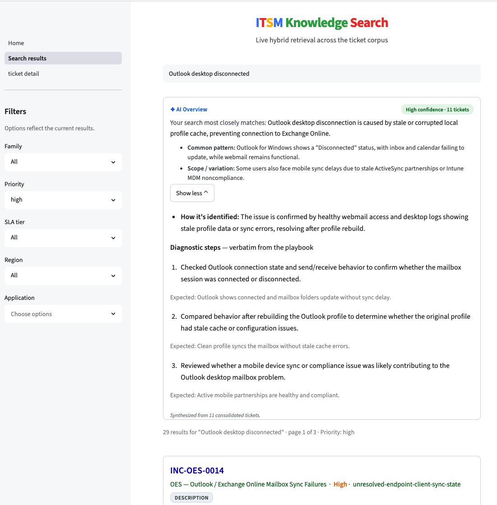
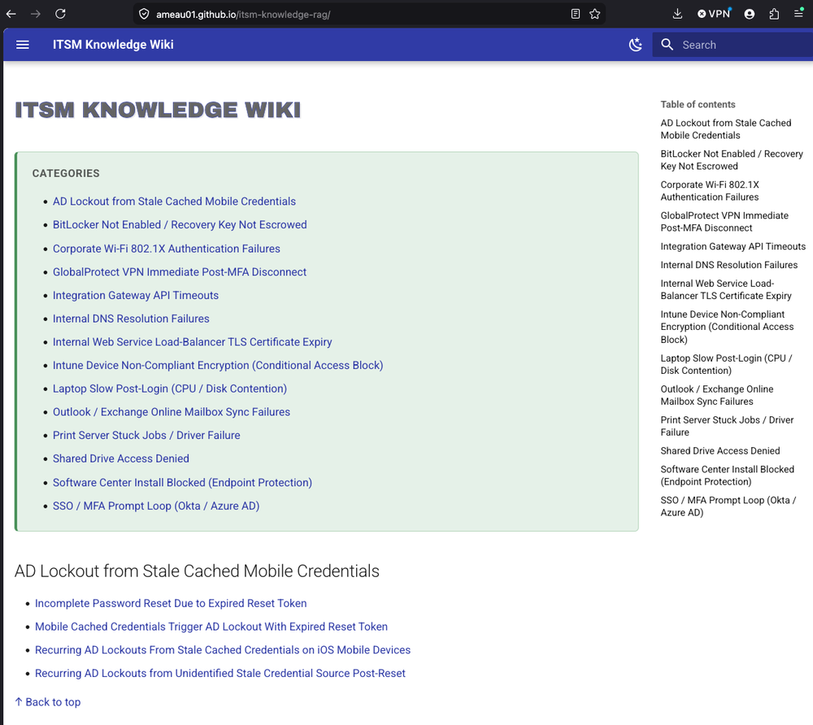

# ITSM Knowledge RAG

[](#project-status)
[](https://itsm-knowledge-rag-ameau01.streamlit.app/)
[](LICENSE)
[](https://huggingface.co/datasets/ameau01/synthetic-it-support-tickets)
[](https://qdrant.tech)
[](https://microsoft.github.io/presidio/)
[](https://deepeval.com/guides/guides-rag-evaluation)
[](pyproject.toml)
[](https://github.com/ameau01/itsm-knowledge-rag/actions/workflows/lint-typecheck-test.yml)


**Turns a company's closed IT tickets into searchable, verifiable answers, so problems that have already been solved don't get solved from scratch again. It recommends; the agent decides.**

Similarity is not relevance. A search engine ranks tickets that look alike, but two tickets can read the same and be different problems. So this system does not stop at search. It curates an organization's own resolution history into verified answers, then surfaces the source tickets underneath so an agent can confirm before acting. A general model can describe standard VPN troubleshooting. It cannot know that in this company the disconnect was an expired device certificate fixed through the internal enrollment service. That fact lives only in the company's tickets.

Most RAG systems would stop at retrieving those raw ticket fragments. This system first turns the messy history into one coherent, searchable answer per root cause, then shows the source tickets underneath so an agent can verify before acting.

<p align="center">
  <b><a href="https://itsm-knowledge-rag-ameau01.streamlit.app/">Live demo: agent search</a></b>
  &nbsp;&nbsp;·&nbsp;&nbsp;
  <b><a href="https://ameau01.github.io/itsm-knowledge-rag/">Live wiki: employee pages</a></b>
</p>



<p align="center"><i>The agent-facing search: an AI overview, then the ranked source tickets behind it, running live on a Qdrant Cloud index. <a href="https://itsm-knowledge-rag-ameau01.streamlit.app/">Try the search</a>.</i></p>

<p align="center"><i>Measured end to end: PII recall 98.9%, retrieval recall@10 0.649 (0.970 family), curation faithfulness 0.95 to 0.99, abstention 1.000. Detail in <a href="#results">Results</a>.</i></p>

## The problem

In any organization, the same IT issues recur constantly. An employee's VPN drops right after approving MFA. An account locks minutes after a password reset. A device fails certificate validation. Each time, a support engineer diagnoses the cause, applies a fix, and closes the ticket. Each time, that knowledge effectively disappears.

It is not lost, exactly. It is just unreachable. It sits across thousands of closed tickets. The same issue is described a dozen different ways, padded with back-and-forth correspondence, and mixed with personal data. Nobody re-reads closed tickets. So when the same problem comes in next week, it gets diagnosed from scratch, even though the organization already knows the answer.

The cost lands on both sides. Agents re-solve known issues. Employees wait on answers the company already has.


## What it does

This project turns an organization’s messy, duplicated support tickets into usable institutional knowledge. It is a recommender for human agents, not an auto-resolver.

When a new support ticket arrives, the human support agent can search this system for similar issues. The system returns a quick overview of past resolutions. This summary highlights common symptoms, root causes, and successful fixes. Links to the original source tickets are also provided. The agent decides whether the new ticket is genuinely the same problem and reuses the proven resolution if it fits.

This system never sees the new ticket. The judgment stays with the agent. The system surfaces prior knowledge and ranks the evidence. It does not classify the new ticket, declare a match, or apply a fix. That separation is deliberate. Deciding whether two tickets are the same problem is exactly the call a human should make before applying a fix.


A general-purpose model only knows generic troubleshooting. It does not hold an organization's specific, proven resolutions. This project establishes a knowledge pipeline to turn corporate records into useful, actionable information.

## How it works

Closed tickets run through a pipeline. The result is served through a search interface modeled on the familiar "AI overview, then sources" pattern. The full design is in [ARCHITECTURE.md](ARCHITECTURE.md).

**Redaction runs first, over the whole ticket.** No personal data reaches the searchable layer or any published surface. A declarative policy drives three layers: exact match against the corporate user directory shipped with the dataset, format rules for structured identifiers, and Presidio NER as a catch-all. The directory is the primary control on identity recall, the same pattern as a periodic AD pull in production. Redacting first also removes the person-specific tokens that would otherwise stop curation from generalizing. See [docs/redaction-policy.md](docs/redaction-policy.md).

**Curation consolidates the messy fields.** Users describe the same problem many ways. Curation turns those descriptions into one common, searchable issue statement. The human-determined root cause and resolution are surfaced verbatim, not regenerated. The system organizes the questions. It does not rewrite the answers. See [docs/wiki-curation.md](docs/wiki-curation.md).

**Retrieval is hybrid, and the overview is cached.** Hybrid search matches a query to the right issue family. Qdrant fuses dense and sparse vectors in one query with Reciprocal Rank Fusion. The overview body is precomputed per family. A search returns a prepared answer instead of synthesizing one on every query. The cached overview is the same idea as a Google "AI Overview." Precomputing it maximizes response speed and eliminates redundant LLM inference costs. See [docs/retrieval.md](docs/retrieval.md). The curated pages are held in a relational store that is the source of truth, with the vector index built from it; see [docs/operational-store.md](docs/operational-store.md).

**Two surfaces share one pipeline.** Support agents get the full search: the overview plus ranked source tickets they are authorized to read. General employees get a redaction-safe, browse-only version of the same curated knowledge.


## Results

These metrics exist because the system is measured on whether it produces *usable institutional knowledge*, not just whether it retrieves similar-looking tickets.

Measured on a synthetic corpus of 745 tickets across 14 issue families. The evaluation ground truth is frozen and committed: a canonical catalog of 14 families and 76 root causes with all 745 tickets assigned, a query set of 63 single-answer, 34 ambiguous, and 15 abstention questions, and a per-family abstention certification (210/210 probes returned null).  Redaction and retrieval numbers are measured. Full methodology and per-axis detail in [docs/evaluation.md](docs/evaluation.md), with retrieval detail in [docs/retrieval-evaluation.md](docs/retrieval-evaluation.md). The L2 curation detail in [docs/wiki-evaluation.md](docs/wiki-evaluation.md).

| Axis | Metric | Result |
|---|---|---|
| PII leakage (deterministic) | recall vs. authored sidecar | 98.9% |
| Technical retention | RETAIN-class strings preserved | 97.6% |
| Retrieval (hybrid, shipped) | recall@10 (strict / family) | 0.649 / 0.970 |
| Abstention | accuracy on out-of-corpus queries | 1.000 |
| Curation quality (judge-based) | faithfulness / variation-preservation | 0.95–0.99 / 0.927 |

The PII-leakage check is the one hard, non-circular number. Its ground truth is authored upstream, independently of the redaction system being tested, so the redactor cannot grade itself. The curation metrics are judge-based and reported as such. The project is explicit about which guarantees are deterministic and which are interpretive.


## Quick start

Three paths to run it yourself, or skip setup and open the hosted demo at **[itsm-knowledge-rag-ameau01.streamlit.app](https://itsm-knowledge-rag-ameau01.streamlit.app/)** (agent search on a Qdrant Cloud index). Full detail in [docs/running.md](docs/running.md).

**Path A. Docker, mock mode (no LLM, no key, no network).**
```
docker compose up rag-demo
```
Loads the operational store from committed SQL seeds (tickets + curated overviews) and serves live local retrieval, with no Hugging Face download, no redaction, no LLM key. (First run auto-builds the image; add `--build` to force a rebuild.)

**Path B. Docker, live ingest (real HF download + Presidio redaction).**
```
cp .env.example .env   # config only — no LLM key needed
docker compose up rag-live
```
Builds the image, starts Qdrant, ingests the corpus with live redaction, applies the curated L2 content from the committed seeds, embeds, and serves the search app at http://localhost:8000. The first run downloads the corpus and the dense model (about 2 GB, cached in a volume). Retrieval is dense + sparse + RRF, all local. No LLM key is needed: curation and overviews ship as SQL seeds; a key is only for regenerating the seeds or running the judge eval.

**Path C. Local, no Docker (developer).**
```
uv sync --group retrieval --group app
cp .env.example .env
uv run sh scripts/run_demo.sh
```
The same build-and-serve without containers. Full detail in [docs/running.md](docs/running.md).

**Stopping, re-running, and cleanup (Docker).**
```
docker compose up -d rag-live      # run detached (frees your terminal)
docker compose down                # stop + remove containers; image and data volumes kept
docker compose up rag-live         # re-run: reuses the image and the built index, serves at once
docker compose down -v             # also remove the data volumes (index, store, model cache)
```
Plain `down` keeps the volumes, so the next `up` serves in seconds. `down -v` deletes them, so the next `up` re-ingests and re-downloads about 2 GB. Use `-v` only for a clean slate. Full cleanup options and the rebuild flags are in [docs/running.md](docs/running.md).


## The wiki (employee-facing knowledge pages)

The curated knowledge is also published as a static **MkDocs** site (one page per root cause), served separately from the search app and on its own port (`WIKI_VIEW_PORT`, default 8001). It reads the operational store, not the vector index, so it has no Qdrant dependency.

It is deployed live on GitHub Pages: **[ameau01.github.io/itsm-knowledge-rag](https://ameau01.github.io/itsm-knowledge-rag/)**, built from the committed `mkdocs/` by a key-free `mkdocs build` (no LLM runs in CI).



<p align="center"><i>The agent-facing search returns a synthesized overview — curated from the organization’s past resolutions — followed by the ranked source tickets for verification. <a href="https://itsm-knowledge-rag-ameau01.streamlit.app/">Try the live demo</a>.</i></p>

```
docker compose up wiki-demo    # serve the committed mkdocs/ pages, no key, no DB, instant
docker compose up wiki-live    # ingest + build a fresh site into .mkdocs/, then serve that
```

**The pages are generated, not hand-authored.** Each page is rendered deterministically from the `wiki_pages` table. The plain-language summary comes from LLM curation. Diagnostics, environment stats, and resolution examples are surfaced verbatim from the tickets. The rendered pages are committed, so GitHub Pages deploys them with a key-free `mkdocs build`. No LLM step runs in CI. `wiki-demo` serves the committed snapshot. `wiki-live` rebuilds a fresh site from the store. The generation is fully reproducible. Committing the output is a deploy convenience.


## Scope

This is a focused system, not a platform. It runs on a single ITSM ticket corpus. It uses one inexpensive model throughout. It is not agentic. There is no tool use and no autonomous orchestration. Curation organizes problem descriptions. It preserves the root causes and resolutions human engineers determined rather than arbitrating them. The architecture is deliberately simple. The evaluation is where the rigor goes. The reasoning behind these and other choices is in [docs/decisions.md](docs/decisions.md).


## Dataset

A synthetic ITSM corpus of 745 tickets across 14 issue families. PII is injected into the free-text fields. Two authored ground-truth sidecars back the deterministic redaction axes: `pii.json` (what must be removed) and `retention.json` (what must survive). Both are published with the dataset. The corpus is synthetic by design: it gives controllable ground truth, which is what makes the deterministic eval possible. No real personal data is involved. Published at [`ameau01/synthetic-it-support-tickets`](https://huggingface.co/datasets/ameau01/synthetic-it-support-tickets). Schema and the sidecar contract are in [docs/dataset.md](docs/dataset.md).


## Repo orientation

```
README.md            this file
ARCHITECTURE.md      system design, diagram, the why behind each layer
docs/                retrieval, evaluation, decisions, dataset, redaction-policy, operational-store, running
src/                 pipeline: redaction, curation, retrieval, serving
eval/                eval harness and results
examples/            real worked outputs: query, overview, source tickets, redaction
```


## Stack

Python, Qdrant (native dense + sparse fusion), AD directory match + format rules + Presidio, DeepEval / G-Eval, MkDocs-Material, Docker.


## Project status

[](https://github.com/ameau01/itsm-knowledge-rag/releases)
[](https://github.com/ameau01/itsm-knowledge-rag)


Implementation complete, with a live agent-search demo and a published wiki.
- LLM Wiki page is published on **[ameau01.github.io/itsm-knowledge-rag](https://ameau01.github.io/itsm-knowledge-rag/)**
- Live search demo page is available at: ** [https://itsm-knowledge-rag-ameau01.streamlit.app](https://itsm-knowledge-rag-ameau01.streamlit.app/)"
- The dataset is published and the design is documented. 
- Published dataset with an authored PII sidecar: [`ameau01/synthetic-it-support-tickets`](https://huggingface.co/datasets/ameau01/synthetic-it-support-tickets).
- Initial design documentation on docs/ folder.
- Added Presidio redaction code to ingestion process, and deepeval for curation evaluation.
- Added DeepEval and G-Eval to measure quality of Wiki pages and AI overview.
- Added Langraph workflow for LLM wiki curation.

## License

MIT.


## Citation

```
@misc{itsm_knowledge_rag_2026,
  title   = {ITSM Knowledge RAG},
  author  = {Alexander Meau},
  year    = {2026},
  version = {1.0.0}
}
```
