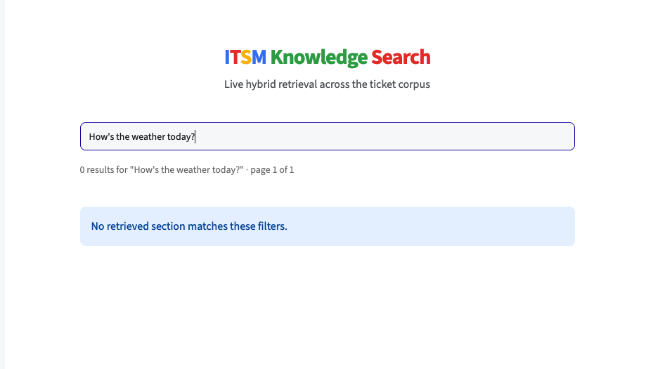

# Retrieval evaluation

How L1 retrieval is measured. L1 returns a ranked list of source tickets for a query. This doc covers three things. Whether the right tickets are found. Whether the parts of the hybrid earn their place. Whether the system declines when the answer is not in the corpus. For the overview layer built on top of retrieval, see [wiki-evaluation.md](wiki-evaluation.md). For where retrieval sits in the system, see [retrieval.md](retrieval.md).

The ground truth is the frozen eval-set under `eval-set/`. The harness reads only those files. See [evaluation.md](evaluation.md) for how the eval-set was built and verified.

## What relevance means here

A retrieved ticket is scored against two labels. Both are exact ids that exist on the query and on the corpus ticket.

- Strict: the ticket's `root_cause_id` matches the query's `expected_root_cause`. This is the real target. The system claims to pinpoint the specific cause. This is the number that measures the claim.
- Lenient: the ticket's `family` matches the query's `expected_family`. This is the easier bar. It is reported as a secondary level.

Matching is id to id. No LLM. No string comparison of free text. No lookup. A retrieved ticket is either the right cause or it is not.

Strict leads the reporting. Family-level alone would flatter the system. There are 14 families. Most have one dominant cause. So almost any retriever finds the right family. The strict number is lower and more honest. It separates the arms where family-level would not.

## The three arms

The hybrid is not assumed to help. It is measured against its parts.

| Arm | What it is |
|---|---|
| Dense only | Embedding similarity alone |
| BM25 only | Sparse keyword scoring alone |
| Hybrid | Dense and BM25 fused with Reciprocal Rank Fusion |

Dense catches the same problem described in different words. BM25 catches the exact error codes and identifiers that embeddings blur. Fusing them should beat either alone. Whether the hybrid adds something is what the table shows.

## Table 1: retrieval performance

Scored on the 63 simple queries. Strict relevance (`root_cause_id`) leads. Lenient (`family`) is the secondary level.

| Arm | Recall@10 (strict) | Recall@10 (family) |
|---|---|---|
| Dense only | 0.666 [0.597, 0.725] | 0.979 [0.960, 0.995] |
| BM25 only | 0.598 [0.527, 0.665] | 0.948 [0.906, 0.979] |
| Hybrid | 0.649 [0.578, 0.712] | 0.970 [0.941, 0.989] |

Dense and hybrid score about the same on strict. Both beat BM25. The hybrid does not beat dense on this corpus. Error codes that BM25 would add are folded into the dense index text at ingest, so dense alone already carries the lexical signal. The hybrid is kept as the default. It ties dense on quality and has the best mean reciprocal rank.

Hit Rate@10 is not reported. On a corpus with a dominant cause per family it sits near the top for every arm. It does not separate them. MRR is reported as a single figure. Dense 0.805. BM25 0.815. Hybrid 0.827.

Numbers are computed once over the full query set. Uncertainty is a 95 percent bootstrap confidence interval. 1000 query resamples with replacement. The 2.5 and 97.5 percentiles. The retriever has no parameters fit on the query set. There is nothing to cross-validate. At this sample size the interval is wide. That is the honest read, not a number to hide.

## Table 2: semantic quality

A judge-based cross-check, run with DeepEval across the same three arms. Scored on 15 simple queries at three runs each. These are not rank metrics. They read the retrieved context and score it directly. They corroborate Table 1 from a different angle.

| Arm | Contextual Precision | Contextual Relevancy |
|---|---|---|
| Dense only | 0.753 [0.644, 0.846] | 0.732 [0.707, 0.756] |
| BM25 only | 0.659 [0.561, 0.748] | 0.774 [0.743, 0.804] |
| Hybrid | 0.726 [0.614, 0.826] | 0.751 [0.720, 0.783] |

Contextual Precision asks whether relevant context is ranked above irrelevant context. Contextual Relevancy asks whether the retrieved context fits the query. It needs no ground truth. The judge is a different model from any used in the pipeline. Temperature is zero. LLM judges vary run to run, so each score is measured at three runs. The sample is 15 queries. The intervals are wide and the arms are not cleanly separated.

The two metrics pull apart. BM25 has the highest Contextual Relevancy and the lowest Contextual Precision. Its context looks on topic but is poorly ordered. Dense leads on precision. No single section of a ticket scores highest on both. The section most on topic for the query is often not the section that names the cause. Similarity and relevance are not the same measurement. That is the reason retrieval spans several section points and a second layer sits on top.

## Complex queries

Scored on the 34 complex queries, held out from any tuning. These carry more than one valid root cause on purpose. They are the corpus-discovered sibling ambiguities where several causes are genuinely plausible.

Scoring is against the candidate set, not a single id. The metric is candidate-set recall over `expected_root_cause`, with a penalty for over-hedging. Returning five causes when two were right is not a win.

| Metric | Result |
|---|---|
| Candidate-set recall@10 | 0.725 |

This is the class where the system should hold up under ambiguity. The result is reported as measured, on queries the tuning never saw.

## Abstention

Scored on the 15 abstention queries, also pure held-out test. These have no answer in the corpus. The correct behavior is to decline, not to return the closest thing.

Abstention here is calibration, not classification. Semantic retrieval always returns something with some score. There is no built-in signal for no match. The decision is made on the dense top-1 cosine similarity. An out-of-corpus query has no close match, so its best cosine is low. An in-corpus query has at least one close match, so its best cosine is high. The fused RRF score was tested for this signal and rejected. RRF is rank-based, so its value does not track match quality. The dense cosine separates the two classes far better. Its separation AUC is 1.000 against 0.944 for the fused score.

The threshold is set from the in-corpus score distribution. It is the floor below which a legitimate match does not fall. The abstention set only tests that threshold. It is never used to tune it.

| Metric | Result |
|---|---|
| Abstention accuracy | 1.000 |
| False-abstention rate (on simple and complex) | 0.052 |

The floor is the 5th percentile of in-corpus dense cosines, 0.6197. Two distributions are recorded alongside the numbers. The dense cosines of in-corpus matches. The dense cosines of the out-of-corpus queries. They separate cleanly on this set. In-corpus scores stay above the floor. Out-of-corpus scores fall below it. That is a strong result. The caveat is sample size. There are 15 out-of-corpus queries, so the clean gap is strong but provisional. The harder case is a near-miss query in the same family with the wrong cause. That is a separate test.

## What is not measured

There is no end-to-end metric for whether the agent's final fix was correct. That depends on the agent, who is outside the system. These metrics measure retrieval, which is the part the system controls. The boundary is stated, not hidden.
