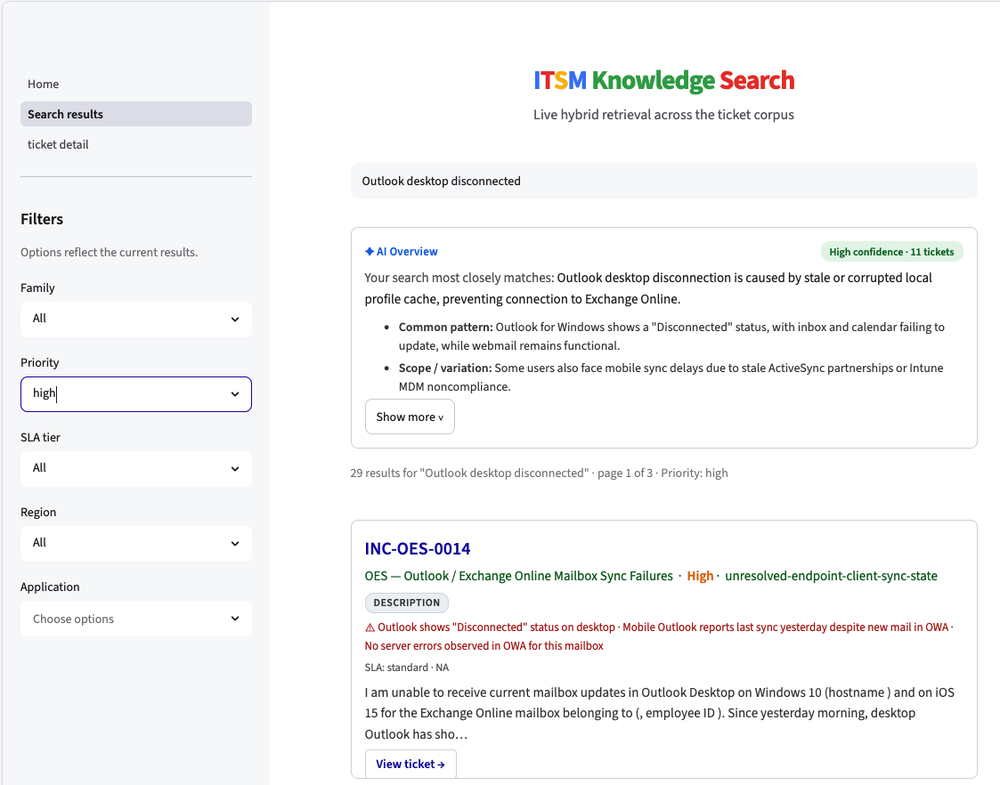

# Retrieval: L1 and L2

Similarity is not relevance. Two tickets can read alike and be different problems. Two can read differently and be the same root cause. A retriever ranks by similarity, so even the best search returns a list that still needs judgment. That gap is the reason this system has a second layer.

L1 is raw-ticket search. L2 is the cached overview. They are weak alone and strong together. For where this sits in the system, see [ARCHITECTURE.md](../ARCHITECTURE.md). For how each is measured, see [retrieval-evaluation.md](retrieval-evaluation.md) and [wiki-evaluation.md](wiki-evaluation.md).

## The two layers

| Layer | What it returns | Built |
|---|---|---|
| L1 | Ranked source tickets, with snippets | Per query, at search time |
| L2 | A synthesized overview for the issue family | Once, during ingest, then cached |

L1 is retrieval. L2 is the precomputed wiki page. A query hits both: L2 gives the prepared answer, L1 gives the evidence underneath it.

## L1: hybrid retrieval

L1 is a funnel. Two retrievers, fused into one ranked list.

Dense retrieval embeds the tickets and the query, then matches by vector similarity. It catches semantic matches. A query about "cannot sign in after reset" finds tickets about account lockout even with different words.

Sparse retrieval scores exact terms with BM25. It catches identifiers, error codes, and product names that embeddings blur. A query naming a specific error string surfaces tickets carrying that exact string.

The two are fused into one ranked list with Reciprocal Rank Fusion. RRF merges by rank, not by raw score, so the two retrievers' incompatible score scales never have to be reconciled. Dense alone misses exact codes. Sparse alone misses paraphrase. The fusion is meant to get both. Whether it beats either component alone is measured as an ablation, not assumed. See [retrieval-evaluation.md](retrieval-evaluation.md).

Qdrant is the vector store. It holds both the dense and sparse vectors and fuses them in a single query, so the fusion is not hand-rolled in application code. Tickets are indexed after redaction. No personal data enters the index.

The funnel: fuse with RRF, then return the top results. Abstention is decided on the dense similarity score, covered below.

## Knowing when to decline

L1 always returns something. A semantic retriever ranks whatever is closest, even when nothing in the corpus fits. So the system needs a way to say the answer is not here.

That decision is made on the dense top-1 cosine similarity. An out-of-corpus query has no close match, so its best cosine is low. An in-corpus query has at least one close match, so its best cosine is high. Below a calibrated floor, the system abstains rather than return a confident wrong answer. How the floor is set and tested is in [retrieval-evaluation.md](retrieval-evaluation.md).

The same cosine signal also filters the results that are returned. Retrieval ranks by fused RRF. Each candidate also carries its own dense cosine score. A candidate below a relevance floor is dropped, even when other candidates pass. So the result count is not fixed. A sharp query returns a long list. A vague query returns a short one. A query with nothing above the floor returns an empty list. That empty case is the abstention above. The list reflects real matches. It is not padded to a fixed size.

## L2: the curated overview

L2 is the curated wiki page for an issue family, built once during ingest.

At query time the matched family's overview is read from cache, not generated. This is the key efficiency choice. The alternative, zero-shot synthesis, would run an LLM over retrieved tickets on every query: slow, costly, and lower quality because it synthesizes in one rushed pass with no cross-ticket consolidation. The cached overview pays that cost once, offline, and amortizes it across every future query. The cache is the relational store; how it is read at build and query time is in [operational-store.md](operational-store.md).

The experience matches a Google AI Overview: a prepared answer on top, the sources below. The difference is the mechanism. A web overview is generated live because the web is unbounded. This corpus is bounded, so the overview is precomputed.

## Generative versus extractive

L2 is part generated, part copied, and the split matters for evaluation.

The description consolidation is generated. A model writes the one coherent issue statement from the many source descriptions. The golden fields inside the page are extractive. The root cause and resolution are surfaced verbatim from the ticket, never rewritten. Only the generated part can drift from its source, so only the generated part is faithfulness-checked. A copied field has nothing to hallucinate. See [wiki-evaluation.md](wiki-evaluation.md) for how this scopes the curation metric.

## Why both, not either

L2 alone is a confident summary with no way to verify it. L1 alone is a pile of tickets the agent must read and synthesize by hand. Together they serve the real workflow. The overview gives the likely answer fast. The ranked source tickets let the agent confirm it before acting. The recommender model depends on this pairing. The system answers, the agent verifies. See [ARCHITECTURE.md](../ARCHITECTURE.md).
