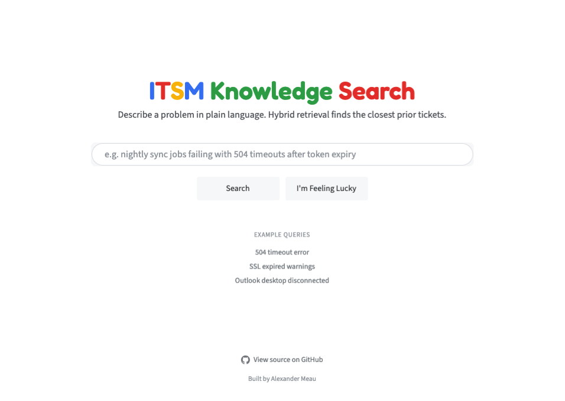
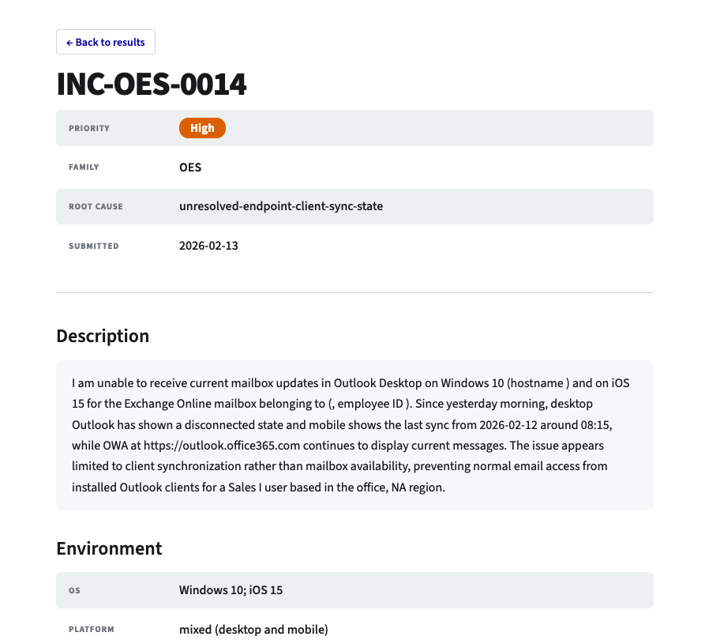

# Running the system

Two modes. Mock mode replays recorded fixtures and needs no API key. Live mode runs the real models and the live retriever. For what the system does, see the [README](../README.md). For how it works, see [ARCHITECTURE.md](../ARCHITECTURE.md).

Everything upstream and downstream of the model call is identical across modes. Only the LLM client swaps. The same pipeline, index, redaction, and eval run in every mode.


## Mock mode (no key)

No LLM, no API key, no network. The fastest way to see the system run. It replays recorded fixtures through the real pipeline, including the L2 curated overviews, and serves the views with a MOCK MODE banner so it is never mistaken for live generation.

```
docker compose up --build demo
```

Use this to see the search interface, the overview-plus-sources layout, and the two views, without any setup.


## Live mode, from scratch

For a reviewer who wants real retrieval. The setup below builds the index and serves a live search. None of these steps call an LLM. Retrieval is dense + sparse + RRF, all local. An API key is only needed to also run the curated overview (L2) and the judge eval; it is not needed for live retrieval.

1. Install dependencies.

```
uv sync --group retrieval --group app
```

2. Create the env file. Defaults work as is. Qdrant runs embedded on disk, so there is no server to start and no Docker. Add `OPENAI_API_KEY` only if you also want the judge eval.

```
cp .env.example .env
```

3. Build and serve in one command. This redacts the corpus into the operational store and builds the embedding index if they are missing, then starts the app. The first run downloads the corpus and the dense model (about 2 GB, cached in `.hf_cache`) and embeds the corpus; later runs skip the builds and just launch.

```
uv run sh scripts/run_demo.sh --port 8000
```

Open the app, type a problem in plain language, and get the closest ticket sections back by live hybrid retrieval. A few example queries from the eval-set sit under the search box.

For manual control, run the three steps yourself instead: `scripts/run_ingest.sh` (redact to SQLite), `scripts/build_retrieval_index.sh` (embed to Qdrant), `scripts/run_streamlit.sh` (serve).

To use a Qdrant server instead of the embedded store, set `QDRANT_LOCAL=false` in `.env` and point `QDRANT_URL` at it: a local container (`docker compose up -d qdrant`) or a Qdrant Cloud cluster (add `QDRANT_API_KEY`). With a server, run the three steps manually so you control when it is up. Build the index and serve in the same mode; the embedded and server storage formats are not interchangeable.


## What you will see

The live app is a search box over the ticket corpus. Type a problem in plain language and submit.



Results come back ranked by live hybrid retrieval. The filters on the left reflect the retrieved set, not the whole corpus. Each hit shows the matched section and links to the full ticket.


A ticket opens to the full record: description, environment, correspondence, root cause, diagnostics, and resolution.



When nothing in the corpus matches, the app returns no results rather than the closest unrelated ticket. How that abstention is decided and measured is in [retrieval-evaluation.md](retrieval-evaluation.md).


## Retrieval evaluation (no key)

Label-based scoring against the frozen catalog. Recall at strict and family levels.

```
uv run sh scripts/run_classic_evaluation.sh --query q-ait-diag-1 --arm hybrid
```

Swap `--arm` for `dense` or `bm25` to compare the arms. The judge-based cross-check needs `OPENAI_API_KEY` and the `eval` group:

```
uv sync --group retrieval --group eval
uv run sh scripts/run_deepeval_evaluation.sh --query q-ait-diag-1 --arm hybrid
```

Those two score one query, for inspection. To reproduce the whole-eval-set tables in [retrieval-evaluation.md](retrieval-evaluation.md), run the benchmark pair. The label half is no key:

```
uv run sh scripts/run_retrieval_benchmark.sh
```

It prints Table 1 with bootstrap CIs, MRR, complex recall, and abstention across all three arms. The judge half needs the key and the `eval` group:

```
uv run sh scripts/run_judge_benchmark.sh
```

See [retrieval-evaluation.md](retrieval-evaluation.md) for the method and results.


## Resetting

The three build artifacts are gitignored and safe to delete. The recent refactor did not change their format, so a rebuild is optional, but it is the clean way to validate setup from zero.

| Path | Holds | Rebuild with |
|---|---|---|
| `.hf_cache` | corpus + embedding models | re-downloads on next ingest and index, about 2 GB |
| `.operational_store` | redacted tickets (SQLite) | `scripts/run_ingest.sh` |
| `.vector_db` | Qdrant index | `scripts/build_retrieval_index.sh` |

To rebuild the data and index without re-downloading the models, delete `.operational_store` and `.vector_db` only, then re-run steps 4 and 5. Delete `.hf_cache` as well only to test the cold-download path.
