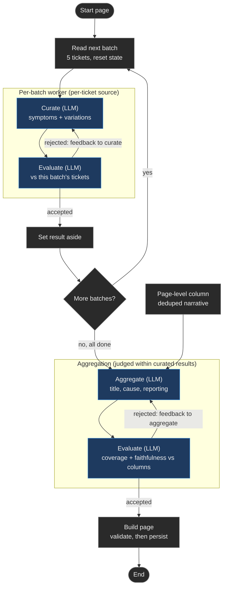

# Wiki curation

How the curated wiki pages are designed and built.

Curation is the L2 build step. It turns many messy tickets for one root cause into a single readable wiki page. The corpus is 745 tickets across 14 families, grouped into 76 pages, one per root cause. Each page is curated independently.

For what the page looks like, see [ARCHITECTURE.md](../ARCHITECTURE.md). For how it is scored, see [wiki-evaluation.md](wiki-evaluation.md).

*Blue is an LLM step. Gray is a plain step, no LLM. One wiki page.*

## The curation challenge

One root cause can carry dozens of tickets. Each describes the same problem a different way, padded with correspondence. The job is to consolidate them into one issue statement, keep the genuinely distinct variations, and invent nothing.

The naive approach is one big prompt: feed every ticket at once. It fails in a specific way. A long context buries the signal. The model compresses early tickets to fit later ones, and detail is lost. Summarization quality drops as the input grows. The whole design exists to avoid that one failure.

## Iterative, in a map-reduce shape

Curation processes tickets in small batches, not all at once. Each batch is a separate model call with a small, focused context. This is the core decision. A single prompt fits this corpus only because the corpus was sized to fit one. Real ticket corpora do not. One root cause can carry years of tickets, far past any context window. The iterative design is the one that holds when the corpus grows. That is why it is built this way, even on a corpus small enough to cheat. Faithfulness and variation scores are in [wiki-evaluation.md](wiki-evaluation.md).

An earlier version carried one running draft and refined it batch by batch. That reintroduced the problem. The running draft compressed the early tickets again, just more slowly. So the design removes the running draft and goes map-reduce. Each batch is curated on its own and set aside. No batch sees another. When all batches are done, one aggregator combines the results into the final page. No single call ever grows large. That is the property the whole design protects.

This follows two patterns from Anthropic's "Building effective agents": prompt chaining and orchestrator-worker. Split a hard task into smaller steps. Let independent workers each handle a piece. Synthesize at the end.

## Self-correction, grounded in the source

A model can write a fluent summary that is subtly wrong. Fluency is not faithfulness. So curation does not trust the first draft.

Each step pairs a generator with an evaluator. The generator writes. The evaluator grades the draft against the source tickets on a fixed rubric, then accepts it or sends back concrete feedback. On feedback, the generator writes again, until the draft passes or a budget is spent. This is the evaluator-optimizer pattern. It fits when there are clear quality criteria and iteration helps. Curation has both.

Two choices make it work. Feedback goes back to the generator, not a separate editor, because regenerating from source holds quality where successive edits to a drifting draft lose it. And the evaluator always sees the source tickets. An evaluator that never sees the source can only check whether text reads plausibly, which is the wrong test. This is the same discipline as the rest of the project. Retrieval grades against a frozen catalog. Redaction grades against an authored sidecar. Nothing grades itself.

## Where each field comes from

Not every field is curated the same way, because not every field has the same source.

| Field | Source | Built by |
|---|---|---|
| Symptoms, variations | User descriptions and correspondence, per ticket | Batch workers |
| Cause | Engineer notes, deduplicated | Aggregator |
| Title | The whole page, for distinctness from siblings | Aggregator |
| Diagnostic steps, resolution | The ticket, verbatim | Not generated |

The high-volume per-ticket content is what needs batching, so symptoms and variations are built by the batch workers. The engineer notes are already short, so the cause is built once at the end. A title must be distinct from its sibling pages, which needs the whole page in view. And the diagnostic steps and resolution are never written by a model. They are surfaced verbatim, because they are the answer a human engineer already proved. That is the spine of the project. The system organizes the questions. It does not rewrite the answers.

The raw diagnostics summary stays in L1 retrieval, where it helps match a query to the right tickets. The curated page does not author a diagnostic field of its own. This keeps the page lean and avoids restating signal that retrieval already carries.

## Variation captured early, preserved late

Keeping distinct variations is the project-specific bar. It is the curation half of the thesis that similarity is not relevance. A page that flattens two different problems into one bland line has lost the thing that makes it useful.

The map-reduce shape puts a seam through this requirement, and the design names it. A variation might appear in only one batch, and a batch worker sees only its own tickets. So the batch captures candidate variations, and the aggregator preserves them without collapsing. The aggregator's evaluator checks exactly that. The split is deliberate and stated, not left to chance.

## What this is, and is not

This is a workflow, not an autonomous agent. The steps are known in advance. The only dynamic decision is whether a draft passes or needs another pass. The design adds structure only where it earned its place: batching to protect quality, an evaluator to protect faithfulness, a reduce step to protect variation. The build runs offline, once, because the corpus is frozen. In a live deployment the same loop runs periodically, re-curating only the affected pages.

The rubric inside the loop steers regeneration. It is not the reported score. Reported quality comes from an independent judge after the page is built, against the source tickets, covering faithfulness and variation preservation. Full results are in [wiki-evaluation.md](wiki-evaluation.md).

## After curation: the AI overview

Curation produces the full wiki page. A separate step then compresses that page into the short answer shown at the top of agent search. This is the AI overview.

The overview is kept outside the curation loop on purpose. It reads the finished page, not the raw tickets, and writes one more field. Because it is decoupled, its prompt can be re-tuned and re-run over the existing pages without re-curating anything. Curation is slow and costly. The overview is fast. Coupling them would make every overview tweak re-run the expensive step. The overview is scored on its own, and those numbers are in [wiki-evaluation.md](wiki-evaluation.md).
